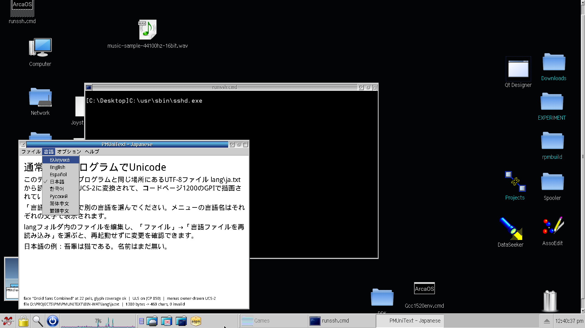
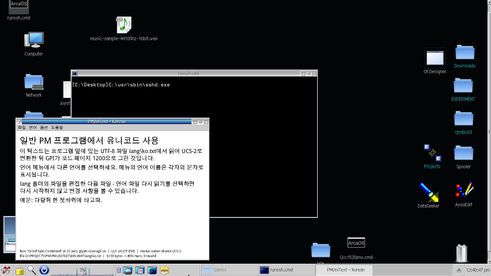

# DEV-SAMPLES-C-PMUniText (PMUniText)

Prototype: **Unicode text (including Japanese, Chinese, Korean, Russian, Greek) in a plain
Presentation Manager program** - no Qt, no SDL, no external libraries. Text comes from UTF-8
language files that sit next to the executable.




## How it works

| Piece | Where | What it does |
|---|---|---|
| UTF-8 language files | `lang\*.txt` | `KEY=value`, `\n` = line break, `#` comment; added/edited without recompiling |
| UTF-8 text | `src\lang.c` `utf8_sanitize()` | text stays UTF-8 in memory; BOM skipped, malformed sequences become U+FFFD |
| Drawing | `src\uni.c` `uni_begin/uni_draw` | the UTF-8 is converted to UCS-2 for every GPI call and drawn in **code page 1200**: logical font with `usCodePage = 1200`, `GpiSetCp(hps, 1200)`, `GpiCharStringAt` with the length in bytes (2 per character) |
| Menus | `src\main.c` | every item switched to `MIS_OWNERDRAW`; the UTF-8 label is the item handle (`hItem`) and is painted with the same drawing code |
| Plain fallback | `uls_to_cp()` | UTF-8 -> process code page through ULS (`UCONV.DLL`, loaded at run time); `?` for characters that do not exist in the code page |
| Font choice | `resolve_face()` | per-language `FONT=` list, then built-in candidates; a face is accepted only if it really draws the language's characters (rendered into a memory bitmap and compared with the face's "missing glyph") |

Language menu items are labelled with each language's own name (`LANG_NAME`), so every script is
visible in the menu at once.

## Findings (ArcaOS 5.1, tested in the VM)

* **Render in code page 1200 (UCS-2), not 1208.** GPI accepts UTF-8 directly (a font created with
  `FATTRS.usCodePage = 1208` and `GpiSetCp(hps, 1208)` draws the same pels as the UCS-2 text in
  code page 1200; `probe\probe1208.c`, `probe\probe1208.log`), but 1208 is meant for reading and
  writing UTF-8, not for display: it is much slower to render. 1200 is also a standard Unicode
  encoding (UCS-2 / the fixed-width subset of UTF-16) and the GPI text functions take length-bounded
  byte arrays, so a UniChar string goes in as it is, without a terminator. Thanks to Alex Taylor,
  who tested this extensively (his own samples: https://altsan.org/os2/toolkits/uls/index.html#samples).
  (The first version of this sample used 1200, version 0.3 switched to 1208 after a suggestion by
  Dave Yeo, version 0.4 is back on 1200 for the speed.) Note that the *font's* code page decides:
  a font created for 1200 followed by `GpiSetCp(1208)` draws garbage.
* GPI length arguments are in **bytes** (2 per UniChar for code page 1200).
* Non-BMP characters (4-byte UTF-8) are sent as surrogate pairs; they do not crash, but the tested
  fonts have no glyphs for them (two missing-glyph boxes).
* Faces that contain Kana, Kanji/Hanzi and Hangul glyphs: `Droid Sans Combined`,
  `Times New Roman MT 30`, `Monotype Sans Duospace WT J`, `Times New Roman WT J`.
  Latin/Greek/Cyrillic: most of the installed outline fonts. Full list: `probe\probe.log`.
* **PM sends `WM_MEASUREITEM` / `WM_DRAWITEM` of a menu to the frame (the menu's owner), not to the
  menu window.** Subclassing only the menu window gives an empty menu bar.
* The title bar and standard controls cannot show Unicode. The title therefore uses the ASCII
  English language name (`LANG_ENGLISH`); everything else that must be localized is drawn.
* Plain (non-owner-drawn) menus work but show `?` for anything outside code page 850. Switch
  between both modes in *Options* to see the difference.

## Mnemonics and accelerators

* **Mnemonics:** put one `~` before the letter in a `MENU_*` value, like a normal PM menu
  (`MENU_FILE=~File`). For scripts without Latin letters use the Asian convention and add the
  Latin letter in parentheses (`MENU_FILE=ファイル(~F)`). The mnemonic is underlined in the
  owner-drawn item; Alt+letter opens a top-level menu and a plain letter runs an item of an open
  submenu (PM only does this for text items, so `main.c` does it for owner-drawn ones). In
  plain-text mode PM handles the `~` itself.
* **Accelerators:** keys are bound in the `ACCELTABLE` in `src\main.rc` (F5 reload, Ctrl+X exit,
  Ctrl+U Unicode menus, Ctrl+B larger, Ctrl+S smaller, F1 about). The key names shown right-aligned
  in the menu come from the `accels[]` table in `main.c`, so keep both in sync.
* PM does not set `KC_CHAR` for Alt+letter `WM_CHAR` messages; check `KC_ALT` and the character code.

## Limits of the prototype

* Only the BMP is usable in practice: GPI accepts non-BMP UTF-8 (emoji, rare CJK ideographs) but the
  installed fonts have no glyphs for it. No right-to-left or complex shaping (Arabic, Hebrew,
  Indic) - GPI does no layout.
* No text input / IME. Entry fields, MLEs and list boxes still use the process code page.
* IPF help (`wipfc`) is not Unicode; a Unicode help text would need its own viewer.

## Command line

`pmunitext [-plain] [-lang code] [-log]`   (`-log` writes `pmunitext.log` with the owner-draw messages)

## Build (both toolchains)

* Open Watcom: `compile_wat.cmd` -> `bin-wat\pmunitext.exe` (+ `bin-wat\lang\`)
* GCC / kLIBC: `compile_gcc.cmd` -> `bin-gcc\pmunitext.exe` (+ `bin-gcc\lang\`)

## Layout

```
src\       main.c (window, menus, painting)  uni.c (UTF-8 helpers, ULS, fonts, drawing)  lang.c (language files)
lang\      en es ru el ja zh_CN zh_TW ko
img\       screenshots
probe\     probe.c + probe.log  (what GPI does with code page 1200 on this system)
           probe1208.c + probe1208.log  (GPI with UTF-8 / code page 1208: works, but slower than 1200)
```

## License

BSD 3-Clause (see `LICENSE`), same as the PM Template.

## Release notes

* 0.4 - drawing is back on code page 1200: `uni.c` converts the UTF-8 text to UCS-2 for each GPI call (`uni_width`, `uni_draw` and the font coverage test), the font and `GpiSetCp` use 1200. Code page 1208 renders correctly but is slow (feedback from Alex Taylor). The `uni_*` functions still take UTF-8 and byte lengths, so the callers did not change.
* 0.3.1 - build scripts: `compile_gcc.cmd` sets `MAKESHELL=cmd.exe` (make could not find a shell on some systems; fix by Dave Yeo) and both compile scripts now use `setlocal`/`endlocal`, so they no longer change the caller's environment (`MAKESHELL`, `EMXOMFLD_*`, `PATH`...). The wlink settings stay: the default ilink gave warnings and an executable that hung the system. Also fixed in 0.3 and worth knowing: in 0.1/0.2 the Options - Font submenu could show shortcut texts ("Ctrl+U", "Ctrl+B"...) instead of the font names, because the owner-drawn items pointed into a small rotating buffer that was overwritten by later calls; 0.3 no longer uses that buffer.
* 0.3 - text was drawn as UTF-8 through GPI code page 1208 (replaced by 0.4).
* 0.2 - mnemonics (underlined, Alt+letter and letters in open submenus) and accelerator column for owner-drawn menus.
* 0.1 - first prototype (October 2026).
